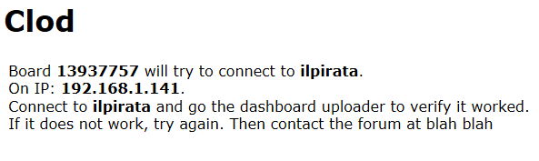
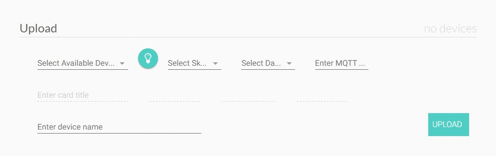

Clod
======

Clod is a system for easily deploying IoT devices based on espressif chips like the ESP8266. It is intended to be self-contained within the user's network, so that data and controls are private and isolated from the internet. Its components are a disorganized mess of other great open source software projects that together form a coherent user experience. A clod is a clump of dirt, which is the opposite of a stack, and as far as one can get from a cloud.

The main components of Clod are:

* Mosquitto MQTT server - intended to run on a Raspberry Pi, this facilitates communication with the devices via the MQTT protocol.

* [Clod MQTT standard](https://github.com/jakeloggins/Clod-MQTT-standard) - an intuitive location-based syntax for MQTT messages.

* [Clod Scripts](https://github.com/jakeloggins/Clod-scripts) - monitors the messages in order to add functionality such as persistence, scheduling, and uploading.

* [Crouton](https://github.com/jakeloggins/crouton-new) - a dashboard for controlling devices and viewing their output.

* PlatformIO - manages OTA software updates and changes to the espressif chips.

* Arduino core for ESP8266.

* [ESP8266 WiFi Manager](https://github.com/tzapu/WiFiManager)

* [Clod Sketch Library](https://github.com/jakeloggins/Clod-sketch-library) - Arduino sketches that have been modified for use with Clod and ESP8266 chips.

Raspberry Pi Installation
--------------------------

This section will cover the initial setup of the Raspberry Pi, which will manage device communication, monitoring, and maintenance. There are two options for completing it:

* A [step-by-step guide](pi-install.md):
  * Approximately 1 hour to complete all of the steps.
  * Requires the use of a monitor connected to the Pi throughout the setup process.

* A [disk image](disk-image-install.md) with Raspbian and all of the steps in the guide already completed.
  * Significantly faster process. Just mount the disk image to an SD card and insert it into the Pi.
  * Does not require the use of a monitor.

ESP8266 Installation
--------------------

* Install the Initial Configuration script on your ESP8266 by following [this guide](https://github.com/jakeloggins/Clod/blob/master/esp-install.md).

Getting Started
----------------

* **Prerequisites**:
  * All of the components installed, configured and running properly on your Raspberry Pi. 
  * An esp8266 chip loaded with the initial configuration script.

* Point your browser to the Crouton landing page (default: http://192.168.1.160:8080).

* Turn on your esp8266 and connect to the wifi network "Clod" with a mobile device.

* Select your home wifi network's SSID from the list and enter the password.

* Make a note of the information displayed on the screen.

* In Crouton, select the "Connections" tab.

* In the "Upload" section, select the device from the available devices drop down and upload your desired sketch.

* If the sketch uploaded successfully, you'll see a prompt at the bottom of the screen.

  * The prompt may display a link to assembly and configuration information unique to the sketch. If it does, follow the directions. 

* Once successfully uploaded and configured, select the device from the "Devices" section and click add.

* View information and controls from your device on the "Dashboard" tab.

* You're done. Enjoy!

Advanced Topics
---------------

Check out the [Clod Sketch Library](https://github.com/jakeloggins/Clod-sketch-library) to see what you can do with Clod. If you don't see something useful, [make your own sketch](https://github.com/jakeloggins/Clod-sketch-library#custom-sketch-protocol) or [email a suggestion]().

Don't like the Crouton interface? Everything in Clod is managed by MQTT messages. Crouton is simply one of many ways to send and receive them. Familiarize yourself with the [data structure](https://github.com/jakeloggins/crouton-new/blob/master/example_of_objects.md) and make your own interface. 

Want to add a non-espressif device? Use the example [python](https://github.com/jakeloggins/Clod-scripts/tree/master/clients/python) and [arduino](https://github.com/jakeloggins/Clod-scripts/tree/master/clients/non_esp_arduino_example_basic_blink) clients.

